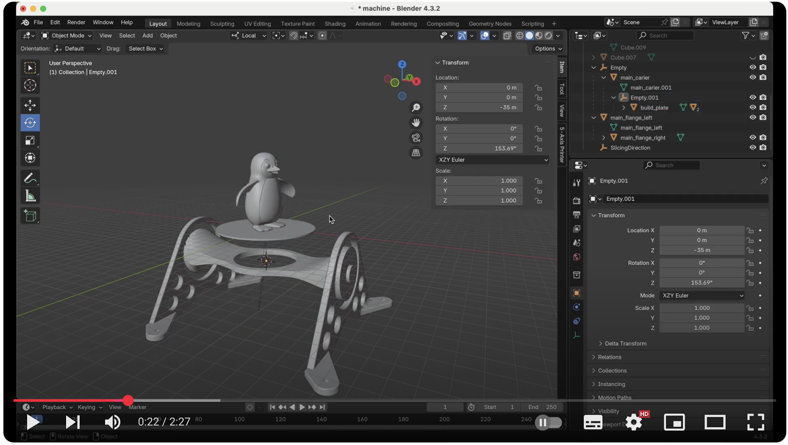
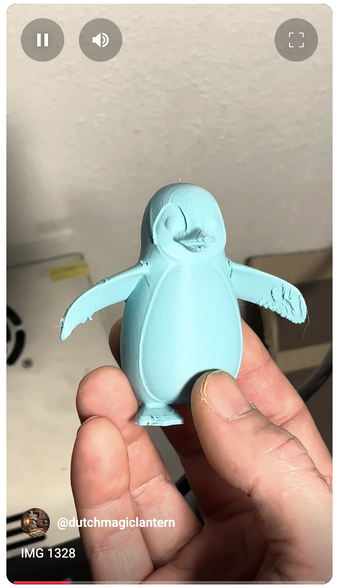
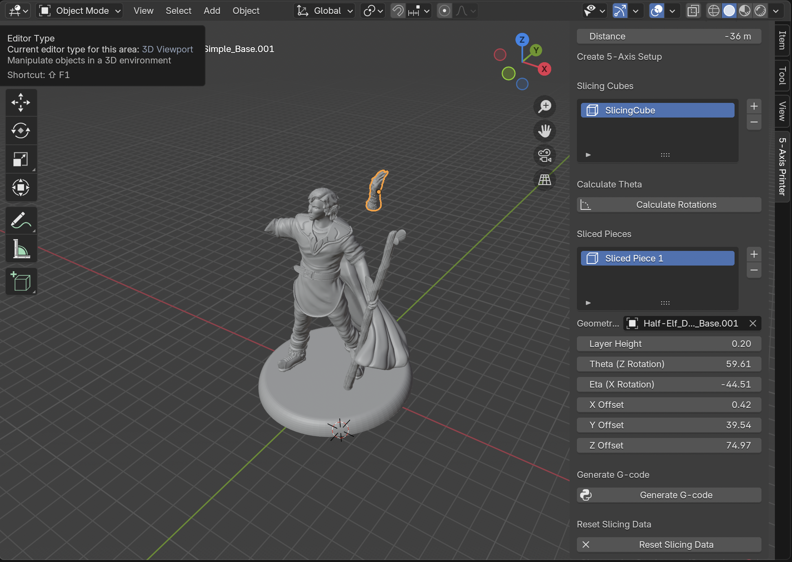
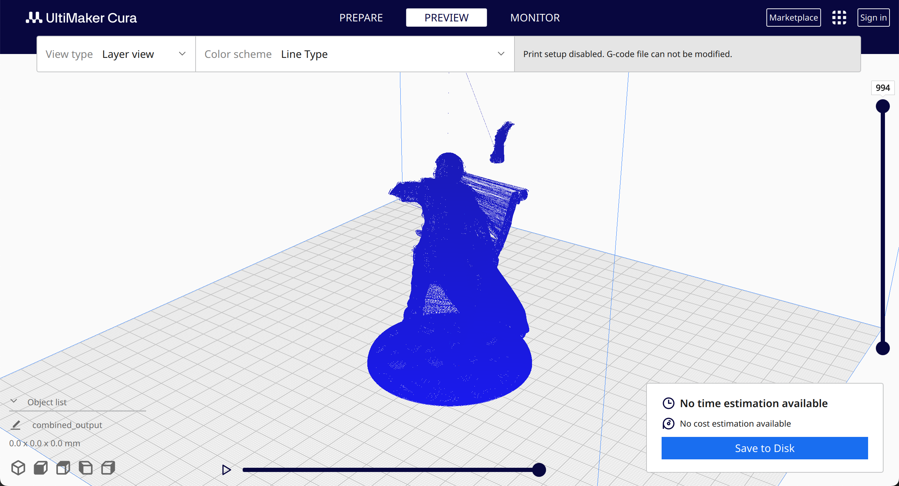

5 axis addon for Blender and CuraEngine

Functionality:

1) Create "slicing cubes" that define regions to be pronted in anouther orientation
2) Calcualate A and B axis rotations based on the slicing cube orientation
3) Slice off the region based on the slicing cube
4) The A and B axis rotation for each piece is stored with the sliced piece
5) Create Gcode of the main piece and the subsequent sliced pieces and combines it in a single gcode file

Use case:

1) Print overhanging geometry by rotating the build plate
2) Avoid using support material and avoid stringy quility for overhanging geometry

Installation:

1) Download the addon file
2) Go to Blender > Edit > Preferences > install addon from local file > point to addon file
3) In the viewport the panel "5 - Axis printer" appears 

Requirements:

1) Blender
2) CuraEngine command line executable

